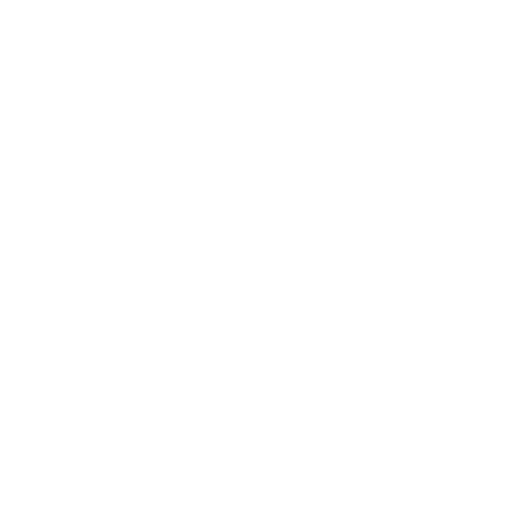

# ClickUp MCP Server - Premium


<div align="center">

<a href="https://www.npmjs.com/package/@taazkareem/clickup-mcp-server" target="_blank" rel="noopener noreferrer"></a>
<a href="https://www.npmjs.com/package/@taazkareem/clickup-mcp-server" target="_blank" rel="noopener noreferrer"></a>
[](LICENSE)


<a href="https://github.com/TaazKareem/clickup-mcp-server/graphs/commit-activity" target="_blank" rel="noopener noreferrer"></a>

</div>

---

**Properly Connect ClickUp to AI Agents and Agentic Workflows**

*A high-performance Model Context Protocol (MCP) server for managing tasks, comments, tags, lists, folders, files, docs, chat, and time using natural language.*

**⭐️ Proven Performance:** 460+ Stars & thousands of weekly NPM downloads. The industry-standard ClickUp integration for AI.

---

## 📖 Table of Contents

| Links&nbsp;&nbsp;&nbsp;&nbsp;&nbsp;&nbsp;&nbsp;&nbsp; | Quick&nbsp;Start&nbsp;&&nbsp;Installation |
| :--- | :--- |
| •&nbsp;[Features](#features)<br>•&nbsp;[Premium&nbsp;Access](#premium-access)<br>•&nbsp;[Available&nbsp;Tools](#available-tools)<br>•&nbsp;[Adv.&nbsp;Config](#advanced-configuration)<br>•&nbsp;[FAQ](#faq)<br>•&nbsp;[Disclaimer](#disclaimer) | <table border="0" style="border: none; border-collapse: collapse; width: 575px;"> <tr style="border: none;"> <td width="140" style="border: none; vertical-align: middle; white-space: nowrap;">[ Cursor](#cursor-setup)</td> <td width="155" style="border: none; vertical-align: middle; white-space: nowrap;">[ Windsurf](#windsurf-setup)</td> <td width="140" style="border: none; vertical-align: middle; white-space: nowrap;">[ VS&nbsp;Code](#vscode-setup)</td> <td width="140" style="border: none; vertical-align: middle; white-space: nowrap;">[ Roo&nbsp;Code](#roocode-setup)</td> </tr> <tr style="border: none;"> <td style="border: none; vertical-align: middle; white-space: nowrap;">[ Claude](#claude-desktop-setup)</td> <td st yle="border: none; vertical-align: middle; white-space: nowrap;">[ Claude&nbsp;Code](#claude-code-setup)</td> <td style="border: none; vertical-align: middle; white-space: nowrap;">[ n8n](#n8n-setup)</td> <td style="border: none; vertical-align: middle; white-space: nowrap;">[ Gemini&nbsp;CLI](#gemini-setup)</td> </tr> <tr style="border: none;"> <td style="border: none; vertical-align: middle; white-space: nowrap;">[ Antigravity](#antigravity-setup)</td> <td style="border: none; vertical-align: middle; white-space: nowrap;">[ Codex](#codex-setup)</td> <td style="border: none; vertical-align: middle; white-space: nowrap;">[ ChatGPT](#chatgpt-setup)</td> <td style="border: none; vertical-align: middle; white-space: nowrap;">[ Augment](#augment-setup)</td> </tr> <tr style="border: none;"> <td style="border: none; vertical-align: middle; white-space: nowrap;">[ Auggie](#auggierun-setup)</td> <td style="border: none; vertical-align: middle; white-space: nowrap;">[ OpenClaw](#openclaw-setup)</td> <td style="border: none; vertical-align: middle; white-space: nowrap;">[Other](#other-setup)</td> <td style="border: none; vertical-align: middle; white-space: nowrap;">[➕ Add Agent](mailto:info@taazkareem.com?subject=Add%20Agent%20to%20Allowlist)</td> </tr> </table> |

---

## <a name="features"></a>✨ Features

<table border="0" style="width: 100%; border-collapse: collapse;">
  <tr style="border: none;">
    <td width="50%" style="vertical-align: top; border: none; padding-bottom: 20px;">
      <strong>🔐 Hybrid Authentication</strong><br>
      MCP spec compliant OAuth 2.1 with advanced security hardening. Backwards compatible with API Key/Team ID.
    </td>
    <td width="50%" style="vertical-align: top; border: none; padding-bottom: 20px;">
      <strong>🔍 Intelligent Search</strong><br>
      Fuzzy matching across names, statuses, tags, custom fields, and descriptions. Automatic name resolution—no IDs needed.
    </td>
  </tr>
  <tr style="border: none;">
    <td style="vertical-align: top; border: none; padding-bottom: 20px;">
      <strong>📝 Task Management</strong><br>
      Create, update, move, delete, duplicate, and link tasks. Supports bulk operations, natural language dates, full markdown descriptions.
    </td>
    <td style="vertical-align: top; border: none; padding-bottom: 20px;">
      <strong>⏱️ Time Tracking</strong><br>
      Start/stop timers, view entries, and manage billable time via natural language.
    </td>
  </tr>
  <tr style="border: none;">
    <td style="vertical-align: top; border: none; padding-bottom: 20px;">
      <strong>📄 Document Management</strong><br>
      Create, read, and append to ClickUp Docs (supports full markdown).
    </td>
    <td style="vertical-align: top; border: none; padding-bottom: 20px;">
      <strong>💬 Chat & Collaboration</strong><br>
      Send/retrieve messages in channels and comments with rich-text conversion and user @mention support.
    </td>
  </tr>
  <tr style="border: none;">
    <td style="vertical-align: top; border: none;">
      <strong>🌳 Workspace Control</strong><br>
      Create and navigate spaces, folders, lists, and tags. Switch workspaces mid-conversation.
    </td>
    <td style="vertical-align: top; border: none;">
      <strong>🧠 Smart Defaults</strong><br>
      Session-isolated caching for fast, secure multi-tenant operation.
    </td>
  </tr>
</table>

---

## <a name="premium-access"></a>💎 Premium Access

**This project operates on a Sponsorware model.** A license grants **full access to all 54+ premium tools** with any of the following plans:

| [**Monthly Plan ($9/mo)**](https://buy.polar.sh/polar_cl_3xQojQLgzQXKCLzsxc49YfL6z8hzSBBqh9ivy1qZdwW?utm_source=github&utm_medium=readme) | [**Annual Subscription ($69/yr)**](https://buy.polar.sh/polar_cl_3a8a3055T4CHIoVlSQPsNshOJLUwsM8AHAiIR3y9wTZ?utm_source=github&utm_medium=readme) | [**Lifetime Access ($129)**](https://buy.polar.sh/polar_cl_4ha3uVyJTu4iPZJS1QbBYNTI1MKTvaXXCkZTb45vPPF?utm_source=github&utm_medium=readme) |
| :--- | :--- | :--- |
| • Pay-as-you-go flexibility<br>• 3 device activations<br>• Cancel anytime | • Most Popular ($5.75/mo)<br>• 3 device activations<br>• Priority bug fixes | • **Best Value** (One-time payment)<br>• 3 device activations<br>• Lifetime stability |

**⚡️ Instant Delivery:** Your License Key is delivered immediately via **Polar.sh**. Total setup time is under 2 minutes.

---

## 🚀 Quick Start & Installation

### 1. Prerequisites
*   **License Key:** 💳 <a href="https://buy.polar.sh/polar_cl_tZ2q8jRvtaaduurOkQKKJmRgdD43ZiB5K0GZn0aQcur?utm_source=github&utm_medium=readme" target="_blank" rel="noopener noreferrer">**Purchase here**</a>
*   **ClickUp Credentials:** API Key & Team ID (Only required if running locally/self-hosted).
    <details>
    <summary><strong>How to find your credentials?</strong></summary>

    **ClickUp API Key:**
    1. Log into ClickUp and go to <a href="https://app.clickup.com/settings/apps" target="_blank" rel="noopener noreferrer">ClickUp Settings → Apps</a>.
    2. Click **Generate** under "API Token" (or copy your existing one).

    **ClickUp Team ID:**
    1. Open ClickUp in your browser.
    2. Look at the URL: `https://app.clickup.com/1234567/v/li/987654321`.
    3. The first number (`1234567`) directly after `clickup.com/` is your **Team ID** (Workspace ID).
    </details>

### 2. Choose your Integration

<a name="cursor-setup"></a>
<details open>
<summary>&nbsp;&nbsp; <strong>Cursor</strong></summary>
<br>

**Configuration Path:** `<project-root>/.cursor/mcp.json`

**Option A: Cloud / Remote (Easiest)**
```json
{
  "mcpServers": {
    "ClickUp": {
      "url": "https://clickup-mcp.taazkareem.com/mcp",
      "headers": {
        "X-License-Key": "your-license-key"
      }
    }
  }
}
```

**Option B: Local (stdio)**
```json
{
  "mcpServers": {
    "ClickUp": {
      "command": "npx",
      "args": ["-y", "@taazkareem/clickup-mcp-server@latest"],
      "env": {
        "CLICKUP_API_KEY": "your-api-key",
        "CLICKUP_TEAM_ID": "your-team-id",
        "CLICKUP_MCP_LICENSE_KEY": "your-license-key"
      }
    }
  }
}
```
</details>

<a name="windsurf-setup"></a>
<details>
<summary>&nbsp;&nbsp; <strong>Windsurf</strong></summary>
<br>

**Configuration Path:** `<project-root>/.codeium/windsurf/mcp_config.json`

**Option A: Cloud / Remote (Easiest)**
```json
{
  "mcpServers": {
    "ClickUp": {
      "url": "https://clickup-mcp.taazkareem.com/mcp",
      "headers": {
        "X-License-Key": "your-license-key"
      }
    }
  }
}
```

**Option B: Local (stdio)**
```json
{
  "mcpServers": {
    "ClickUp": {
      "command": "npx",
      "args": ["-y", "@taazkareem/clickup-mcp-server@latest"],
      "env": {
        "CLICKUP_API_KEY": "your-api-key",
        "CLICKUP_TEAM_ID": "your-team-id",
        "CLICKUP_MCP_LICENSE_KEY": "your-license-key"
      }
    }
  }
}
```
</details>

<a name="vscode-setup"></a>
<details>
<summary>&nbsp;&nbsp; <strong>VS Code</strong></summary>
<br>

**Configuration Paths:**
- **Global:** `~/Library/Application Support/Code/User/mcp.json`
- **Local:** `<project-root>/.vscode/mcp.json`

**Option A: Cloud / Remote (Easiest)**
```json
{
  "mcpServers": {
    "ClickUp": {
      "url": "https://clickup-mcp.taazkareem.com/mcp",
      "headers": {
        "X-License-Key": "your-license-key"
      }
    }
  }
}
```

**Option B: Local (stdio)**
```json
{
  "mcpServers": {
    "ClickUp": {
      "command": "npx",
      "args": ["-y", "@taazkareem/clickup-mcp-server@latest"],
      "env": {
        "CLICKUP_API_KEY": "your-api-key",
        "CLICKUP_TEAM_ID": "your-team-id",
        "CLICKUP_MCP_LICENSE_KEY": "your-license-key"
      }
    }
  }
}
```
</details>

<a name="roocode-setup"></a>
<details>
<summary>&nbsp;&nbsp; <strong>Roo Code</strong></summary>
<br>

**Configuration Path:** `<project-root>/.roo/mcp.json`

**Option A: Cloud / Remote (Easiest)**
```json
{
  "mcpServers": {
    "ClickUp": {
      "url": "https://clickup-mcp.taazkareem.com/mcp",
      "headers": {
        "X-License-Key": "your-license-key"
      }
    }
  }
}
```

**Option B: Local (stdio)**
```json
{
  "mcpServers": {
    "ClickUp": {
      "command": "npx",
      "args": ["-y", "@taazkareem/clickup-mcp-server@latest"],
      "env": {
        "CLICKUP_API_KEY": "your-api-key",
        "CLICKUP_TEAM_ID": "your-team-id",
        "CLICKUP_MCP_LICENSE_KEY": "your-license-key"
      }
    }
  }
}
```
</details>

<a name="claude-desktop-setup"></a>
<details>
<summary>&nbsp;&nbsp; <strong>Claude Desktop</strong></summary>
<br>

**Configuration Path:** `~/Library/Application Support/Claude/claude_desktop_config.json`

**Remote Setup (Requires `mcp-remote` adapter):**
```json
{
  "mcpServers": {
    "ClickUp": {
      "command": "npx",
      "args": [
        "-y", "mcp-remote",
        "https://clickup-mcp.taazkareem.com/mcp",
        "--header", "X-License-Key: your-license-key"
      ]
    }
  }
}
```
</details>

<a name="claude-code-setup"></a>
<details>
<summary>&nbsp;&nbsp; <strong>Claude Code (CLI)</strong></summary>
<br>

Run this command in your terminal:
```bash
claude mcp add --transport http ClickUp https://clickup-mcp.taazkareem.com/mcp \
  --header "X-License-Key: your-license-key"
```
</details>

<a name="n8n-setup"></a>
<details>
<summary>&nbsp;&nbsp; <strong>n8n</strong></summary>
<br>

**Option A: Cloud / Remote (Recommended)**
1. In n8n, add an **"MCP Client"** node.
2. Set Connection Type to `HTTP Streamable`.
3. Auth Type: `Multiple Headers Auth`.
4. Header: `X-License-Key` Value: `your-license-key`
5. URL: `https://clickup-mcp.taazkareem.com/mcp`

**Option B: Self-Hosted Docker**
Run the container:
```bash
docker run -d -p 3231:3231 ghcr.io/taazkareem/clickup-mcp-server:latest
```
In n8n, use URL: `http://host.docker.internal:3231/mcp`
</details>

<a name="gemini-setup"></a>
<details>
<summary>&nbsp;&nbsp; <strong>Gemini CLI</strong></summary>
<br>

**Configuration Path:** `~/.gemini/settings.json`
```json
{
  "mcpServers": {
    "ClickUp": {
      "httpUrl": "https://clickup-mcp.taazkareem.com/mcp",
      "headers": { "X-License-Key": "your-license-key" }
    }
  }
}
```
</details>

<a name="antigravity-setup"></a>
<details>
<summary>&nbsp;&nbsp; <strong>Antigravity</strong></summary>
<br>

**Configuration Path:** `~/.gemini/antigravity/mcp_config.json`
```json
{
  "mcpServers": {
    "ClickUp": {
      "serverUrl": "https://clickup-mcp.taazkareem.com/mcp",
      "headers": { "X-License-Key": "your-license-key" }
    }
  }
}
```
</details>

<a name="codex-setup"></a>
<details>
<summary>&nbsp;&nbsp; <strong>Codex (CLI, Desktop, IDE)</strong></summary>
<br>

Codex clients (CLI, Desktop App, and VS Code extension) share a single source of truth for configuration.

**Configuration Paths:**
- **Global:** `~/.codex/config.toml`
- **Per-Project:** `<project-root>/.codex/config.toml`

**Option A: Cloud / Remote (Easiest)**
```toml
[mcp_servers.ClickUp]
url = "https://clickup-mcp.taazkareem.com/mcp"
http_headers = { "X-License-Key" = "your-license-key" }
```

**Option B: Local (stdio)**
```toml
[mcp_servers.ClickUp]
command = "npx"
args = ["-y", "@taazkareem/clickup-mcp-server@latest"]
env = {
  CLICKUP_API_KEY = "your-api-key",
  CLICKUP_TEAM_ID = "your-team-id",
  CLICKUP_MCP_LICENSE_KEY = "your-license-key"
}
```

**Quick Tips:**
- **Codex CLI:** Run `codex mcp list` to verify. Use `codex mcp add ...` as a CLI alternative to editing the file.
- **VS Code Extension:** Click **⚙ → MCP settings → Open config.toml**.
- **Desktop App:** Go to **Settings → Integrations & MCP**.
</details>

<a name="chatgpt-setup"></a>
<details>
<summary>&nbsp;&nbsp; <strong>ChatGPT (Developer Mode)</strong></summary>
<br>

*Note: Requires a Business, Enterprise, or Edu workspace with Developer Mode enabled.*

1. **Enable Developer Mode:** Ask your workspace admin to enable this under **Workspace Settings → Permissions & Roles → Connected Data**.
2. **Connect MCP:** Go to **Settings → Connectors** and toggle **Developer Mode** on.
3. **Add Custom Connector:**
   - Click **Add connector** (or "Create custom connector").
   - Choose **MCP** as the source type.
4. **Configure:**
   - **Server URL:** `https://clickup-mcp.taazkareem.com/mcp`
   - **Authentication:** Add HTTP header `X-License-Key: your-license-key`.
5. **Use:** Start a Developer Mode chat and select your ClickUp connector via **Add sources**.
</details>

<a name="augment-setup"></a>
<details>
<summary>&nbsp;&nbsp; <strong>Augment Code</strong></summary>
<br>

**Configuration Path:** `<project-root>/.augment/settings.json`
```json
{
  "mcpServers": {
    "ClickUp": {
      "url": "https://clickup-mcp.taazkareem.com/mcp",
      "headers": {
        "X-License-Key": "your-license-key"
      }
    }
  }
}
```
</details>

<a name="auggierun-setup"></a>
<details>
<summary> <strong>Auggie CLI</strong></summary>
<br>

Run this command in your terminal:
```bash
auggie mcp add ClickUp --url https://clickup-mcp.taazkareem.com/mcp \
  --header "X-License-Key: your-license-key"
```
</details>

<a name="openclaw-setup"></a>
<details>
<summary>&nbsp;&nbsp; <strong>OpenClaw (via mcporter)</strong></summary>
<br>

OpenClaw integrates MCP servers through **mcporter**, a bridge that handles both HTTP and stdio connections.

**1. Prerequisites:**
- Install mcporter: `npm i -g mcporter`
- Enable the skill in OpenClaw `config.json`:
  ```json
  {"skills": {"allowBundled": ["mcporter"]}}
  ```

**2. Configuration (via CLI):**

**Option A: Cloud / Remote (Easiest)**
```bash
mcporter config add ClickUp \
  --url "https://clickup-mcp.taazkareem.com/mcp" \
  --headers '{"X-License-Key": "your-license-key"}'
```

**Option B: Local (stdio)**
```bash
mcporter config add ClickUp \
  --command "npx" \
  --args "-y @taazkareem/clickup-mcp-server@latest" \
  --env "CLICKUP_MCP_LICENSE_KEY=your-license-key,CLICKUP_API_KEY=your-api-key,CLICKUP_TEAM_ID=your-team-id"
```

**3. Verify & Run:**
- List tools: `mcporter list ClickUp --schema`
- Restart the OpenClaw gateway to auto-detect the new server.
</details>

<a name="other-setup"></a>
<details>
<summary><strong>Other (Custom Agents, etc.)</strong></summary>
<br>

**Advanced: OpenAI Agents SDK**
For developers building custom agents.

**Python SDK:**
```python
from agents import Agent, Runner
from agents.mcp import MCPServerStreamableHttp

async with MCPServerStreamableHttp(
    name="clickup",
    params={
        "url": "https://clickup-mcp.taazkareem.com/mcp",
        "headers": {"X-License-Key": "your-license-key"},
    },
) as server:
    agent = Agent(
        name="Assistant",
        instructions="Use the ClickUp MCP tools when helpful.",
        mcp_servers=[server],
    )
    result = await Runner.run(agent, "List my workspaces.")
```
</details>

### 3. Restart
Restart your MCP Host (e.g., Cursor IDE). The server will validate your License Key and start automatically.

---

## <a name="available-tools"></a>🛠️ Available Tools

<details>
<summary><strong>👇 Click to view all 54 available tools</strong></summary>

| Category | Tool | Description |
| :--- | :--- | :--- |
| **Workspace** | `get_workspace_hierarchy` | Get workspace structure |
| | `get_workspace_members` | Get all workspace members |
| | `find_member_by_name` | Find member by name or email |
| | `resolve_assignees` | Resolve names/emails to user IDs |
| **Tasks** | `create_task` | Create a task |
| | `get_task` | Get single task details |
| | `update_task` | Modify task properties |
| | `move_task` | Move task to new list |
| | `duplicate_task` | Copy task |
| | `delete_task` | Remove task |
| | `create_bulk_tasks` | Create multiple tasks |
| | `update_bulk_tasks` | Update multiple tasks |
| | `move_bulk_tasks` | Move multiple tasks |
| | `delete_bulk_tasks` | Delete multiple tasks |
| | `get_workspace_tasks` | Search tasks with filtering |
| | `get_task_comments` | Get comments on a task |
| | `create_task_comment` | Add a comment to a task |
| | `attach_task_file` | Attach file to a task |
| | `add_task_link` | Link two tasks together |
| | `get_task_links` | Get task dependencies |
| | `delete_task_link` | Remove task dependency |
| **Lists** | `create_list` | Create list in space |
| | `create_list_in_folder` | Create list in folder |
| | `get_list` | Get list details |
| | `update_list` | Update list properties |
| | `delete_list` | Delete a list |
| **Folders** | `create_folder` | Create folder |
| | `get_folder` | Get folder details |
| | `update_folder` | Update folder properties |
| | `delete_folder` | Delete a folder |
| **Tags** | `get_space_tags` | Get space tags |
| | `create_space_tag` | Create tag |
| | `update_space_tag` | Update tag properties |
| | `delete_space_tag` | Delete a tag |
| | `add_tag_to_task` | Add tag to task |
| | `remove_tag_from_task` | Remove tag from task |
| **Time Tracking** | `get_task_time_entries` | Get time entries for a task |
| | `start_time_tracking` | Start time tracking |
| | `stop_time_tracking` | Stop current time tracking |
| | `add_time_entry` | Add manual time entry |
| | `delete_time_entry` | Delete time entry |
| | `get_current_time_entry` | Get running timer |
| **Docs** | `create_document` | Create a document |
| | `get_document` | Get a document |
| | `list_documents` | List documents |
| | `list_document_pages` | List pages in a document |
| | `get_document_pages` | Get page content |
| | `create_document_page` | Add page to document |
| | `update_document_page` | Update page content |
| **Chat** | `create_chat_channel` | Create a chat channel |
| | `get_chat_channels` | List chat channels |
| | `create_chat_message` | Send a message to a channel |
| | `get_chat_messages` | Get message history |
| **Feedback** | `submit_feedback` | Submit feedback or bug reports |

*See [full documentation](docs/user-guide.md) for parameters and advanced usage.*
</details>

---

## <a name="advanced-configuration"></a>⚙️ Advanced Configuration

### Filter Available Tools
💡 **Pro Tip!** Reduce context noise for the AI by limiting available tools.

**Local (Environment Variable):**
```json
"ENABLED_TOOLS": "get_workspace_hierarchy,create_task,get_task,update_task"
```

-or- **Remote (Header):**
```json
"X-Enabled-Tools": "find_member_by_name,create_chat_channel,create_chat_message"
```

### Enable Document Support (Beta)
Enable creation and management of ClickUp Docs:
```json
"DOCUMENT_SUPPORT": "true"
```

---

## <a name="faq"></a>❓ FAQ

**Why isn't this free anymore?**
Building reliable MCP integrations requires significant maintenance. Moving to a paid model allows us to support this as a product rather than a hobby, ensuring compatibility with API changes.

**I have an old version. Will it stop working?**
Existing local clones will continue to work, but you will not receive updates, bug fixes, or support without a license.

**How can I add my AI Agent/Platform to the supported list?**
We welcome new integrations! Please [contact us via email](mailto:info@taazkareem.com?subject=Add%20Agent%20to%20Allowlist) to have your agent's redirect URI added to our allowlist.

**How do I get support?**
Premium users get priority support. Please <a href="https://github.com/TaazKareem/clickup-mcp-server/issues" target="_blank" rel="noopener noreferrer">open an issue</a> in this repository.

---

## <a name="disclaimer"></a>⚖️ Disclaimer

Originally developed as open source and refined during a consultancy with ClickUp, this project is now independently maintained.

This software makes use of third-party APIs and may reference trademarks or brands owned by third parties. The use of such APIs or references does not imply any affiliation with or endorsement by the respective companies. All trademarks and brand names are the property of their respective owners. This project is an independent work and is not officially associated with or sponsored by any third-party company mentioned.

<div align="center">
  <sub>Created by <a href="https://github.com/taazkareem" target="_blank" rel="noopener noreferrer">taazkareem</a></sub>
</div>
