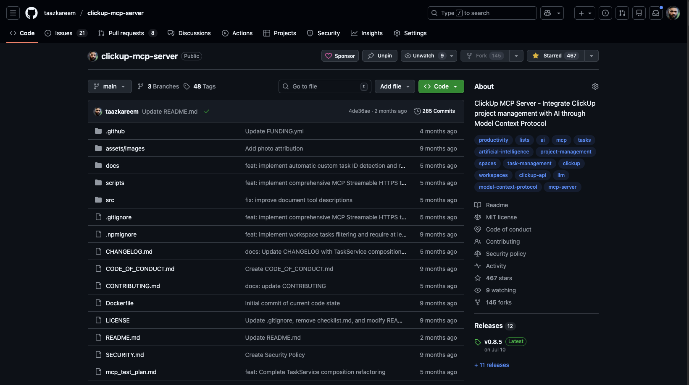

# ClickUp MCP Server


> **⚠️ Status Update: This project has moved to a Premium (Sponsorware) model.**


### Trusted by 460+ Developers


*Snapshot of the repository activity prior to the premium migration.*

Thank you for your interest in the ClickUp MCP Server. Due to the high volume of traffic and the resources required to maintain, update, and support this integration, the source code is now exclusively available to supporters.

This change ensures dedicated time for:
*   **Maintenance:** Keeping up with ClickUp API changes and MCP protocol updates.
*   **Support:** Providing priority assistance to active users.
*   **New Features:** Developing advanced capabilities.

## 🚀 How to Get Access

You can get **instant access** by purchasing a license key. Setup takes less than 2 minutes!

We use **Polar.sh** to handle payments and deliver your license key immediately.

[](https://buy.polar.sh/polar_cl_3xQojQLgzQXKCLzsxc49YfL6z8hzSBBqh9ivy1qZdwW)

**[👉 Click here to purchase a license key](https://buy.polar.sh/polar_cl_3xQojQLgzQXKCLzsxc49YfL6z8hzSBBqh9ivy1qZdwW)**

## ⚡ Super Simple Setup

After purchasing, just add **one environment variable** to your MCP config:

```json
{
  "mcpServers": {
    "ClickUp": {
      "command": "npx",
      "args": ["-y", "@taazkareem/clickup-mcp-server@latest"],
      "env": {
        "CLICKUP_MCP_LICENSE_KEY": "your-license-key-here",
        "CLICKUP_API_KEY": "your-clickup-api-key",
        "CLICKUP_TEAM_ID": "your-team-id"
      }
    }
  }
}
```

That's it! No complex setup, no GitHub tokens, no extra configuration.

## 📦 What is Included?

By purchasing a license, you get:

1.  **Instant Access:** License key delivered immediately after purchase
2.  **Full Functionality:** All 36+ tools for task, document, and workspace management
3.  **Automatic Updates:** Always get the latest features via `npx`
4.  **Priority Support:** Open issues and request features directly

## ❓ FAQ

**How do I get my license key after paying?**
Immediately after purchase on Polar, you'll receive your license key. Just add it to your MCP configuration and restart!

**Why isn't this free anymore?**
Building and maintaining reliable MCP integrations requires significant time. Moving to a paid model allows this to be treated as a supported product rather than a hobby.

**I am already using an old version. Will it stop working?**
If you have already cloned the code locally, your copy will continue to work. However, you will not receive any new updates unless you purchase a license.

**Is it a one-time payment or subscription?**
Check the Polar.sh page for current pricing options.

---
*Created by [taazkareem](https://github.com/taazkareem)*
