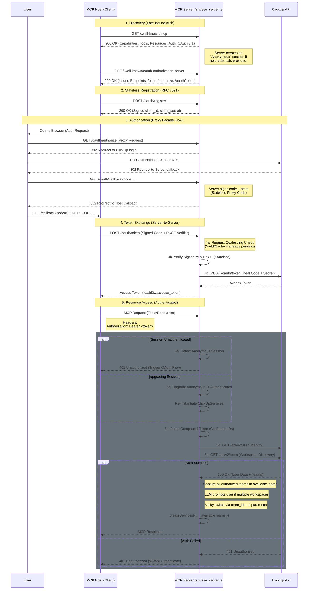

# OAuth 2.1 Architecture

This document describes the **Hybrid Authentication** architecture for the ClickUp MCP Server. It supports both **OAuth 2.1** and **API Key** authentication, functioning primarily over the **HTTP Streamable transport** (with legacy SSE support).

## Overview

The ClickUp MCP Server acts as an **OAuth 2.1 Proxy Facade**. It sits between the **MCP Host** (the client application) and ClickUp's OAuth servers.

This architecture allows the server to:
1.  **Support Stateless Client Registration (RFC 7591)**: Clients can "register" with the MCP server to get credentials dynamically. The server uses cryptographic signatures to manage these clients without a database.
2.  **Manage Secrets Securely**: The ClickUp Client ID and Secret are kept safely on the server, never exposed to the MCP Host.
3.  **Handle Redirects**: The server manages the OAuth callback loop, allowing it to work with various MCP Hosts regardless of their redirect URI restrictions.
4.  **Hybrid Authentication**: The server automatically detects if a client provides API Key headers (`X-ClickUp-Key`) and switches to direct authentication mode, bypassing OAuth discovery to prevent connection errors.

The implementation is coordinated in `src/sse_server.ts` and distributed across modular components in `src/auth/`, `src/services/`, and `src/middleware/` to ensure maintainability and security.

For detailed information on the security hardening measures implemented (CSRF protection, signed state, etc.), see **[OAuth Security Hardening](./OAUTH_SECURITY.md)**.

### Key Files

| Component | File | Description |
| :--- | :--- | :--- |
| **Server Entry** | `src/sse_server.ts` | Configures Express app and integrates Auth components. |
| **OAuth Routes** | `src/auth/routes.ts` | Express Router for RFC 8414/7591 proxy endpoints. |
| **OAuth Service** | `src/services/oauth.ts` | "Proxy Facade" business logic (signing, PKCE, token exchange). |
| **Auth Middleware** | `src/middleware/auth.ts`| Validates Bearer tokens against ClickUp API. |
| **Service Factory** | `src/services/shared.ts` | `createServices()`: Instantiates isolated service layers per request/session. |
| **Config** | `src/config.ts` | Loads `CLICKUP_CLIENT_ID` and `CLICKUP_CLIENT_SECRET`. |

---

## Authentication Flow

The server implements the Model Context Protocol (MCP) Authorization Specification, exposing the necessary metadata for the Host to discover the OAuth configuration.



## Detailed Request Lifecycle

1.  **Incoming Request**: An MCP request (e.g., `CallToolRequest`) arrives at `src/sse_server.ts` via the `POST /mcp` endpoint.
2.  **Auth Middleware** (`src/middleware/auth.ts`): 
    *   The middleware intercept the request and checks for the `Authorization: Bearer <token>` header.
    *   **Compound Token Parsing**: It detects if the token uses the `id1,id2:token` format. If so, it extracts the "Confirmed IDs" to prioritize the user's explicit selection.
    *   **Validation**: It validates the token by making parallel calls to `https://api.clickup.com/api/v2/user` (for identity) and `https://api.clickup.com/api/v2/team` (for workspace context).
    *   **Context Setting**: It captures all authorized teams, but uses the Team IDs from the token to set the primary context and filter guard prompts for the user to select a specific workspace.
    *   Validation results are cached for 10 minutes.
3.  **Service Instantiation & Late-Bound Auth**:
    *   **Anonymous Initialization**: To support OAuth discovery, the server allows clients to `initialize` without credentials. It creates a session marked as `authenticated: false`.
    *   **401 Challenge**: If an unauthenticated session attempts to call a tool, the server returns a `401 Unauthorized` response with a `WWW-Authenticate` header. This triggers clients (like `mcp-remote` or Claude Desktop) to initiate the OAuth flow.
    *   **Session Upgrading**: When a client provides a `Bearer` token on an existing anonymous session, the server transparently "upgrades" the session by re-instantiating `ClickUpServices` with the new credentials, avoiding redundant session setup.
    *   **Configuration Context**: It uses the `defaultTeamId` from the auth middleware as a fallback if the `x-clickup-team-id` header is missing.
4.  **Tool Execution**:
    *   The tool calculates the result using the user's specific token and detected Team ID, ensuring correct permissions and data isolation.
    *   **Context-Aware Errors**: If credentials are missing in a mode where OAuth is available, the server provides helpful guidance for re-authentication rather than standard technical error messages.

## Configuration & Deployment

To enable OAuth 2.1 features, the following environment variables must be configured:

```bash
# Required for OAuth
CLICKUP_CLIENT_ID=your_client_id
CLICKUP_CLIENT_SECRET=your_client_secret
CLICKUP_PROXY_SECRET=random_stable_secret  # Secret for signing proxy codes/clients
MCP_SERVER_URL=https://your-public-server-url.com

# Security Hardening
REDIRECT_URI_ALLOWLIST=http://localhost:*,vscode://*  # Comma-separated allowlist
ENABLE_RATE_LIMIT=true                              # Enable global rate limiting

# Standard Configuration
PORT=3231
ENABLE_SSE=true
```

## Testing & Verification

### 1. Discovery Endpoint
Verify the server advertises OAuth support and correct transport:
```bash
curl http://localhost:3231/.well-known/mcp
curl http://localhost:3231/.well-known/oauth-authorization-server
```
**Expected Output**: JSON containing `issuer`, `authorization_endpoint`, `token_endpoint`, and `code_challenge_methods_supported`.

### 2. Protected Resource Metadata
Verify the resource metadata:
```bash
curl http://localhost:3231/.well-known/oauth-protected-resource
```
**Expected Output**: JSON containing `resource` (server URL) and `scopes_supported`.

### 3. Token Validation (Manual Test)
You can manually test the bearer token validation if you have a valid ClickUp Personal Access Token (PAT) or OAuth token:

```bash
curl -X POST http://localhost:3231/mcp \
  -H "Authorization: Bearer <YOUR_CLICKUP_TOKEN>" \
  -H "Content-Type: application/json" \
  -d '{
    "jsonrpc": "2.0",
    "method": "tools/list",
    "id": 1
  }'
```

**Success**: Returns a list of tools.
**Failure**: Returns `401 Unauthorized`.

## Performance & Security Enhancements

### 1. In-Memory Caching
To prevent rate-limiting and improve latency, the server implements strict in-memory caching for sensitive lookups:

*   **OAuth Tokens**: Validated tokens are cached for **10 minutes** (SHA-256 hashed keys).
*   **Cache Invalidation**: The server **automatically wipes** the identity cache for a token whenever a new `/oauth/token` exchange is completed, ensuring fresh workspace selections take effect immediately.
*   **License Keys**: 
    *   Valid keys are cached for **1 hour**.
    *   Invalid/Error states are cached for **10 minutes** to prevent ddos/spam.
*   **Safety**: All cache keys (tokens/licenses) are hashed using **SHA-256** before storage, ensuring raw credentials never reside in the cache memory.

### 2. HTTPS Enforcement
*   **Strict Transport Security**: The server rejects any request containing a `Bearer` token if it is not sent over HTTPS (unless running on `localhost`).
*   **Strict Fallback**: If a request provides a `Bearer` token but validation fails (e.g., expired token or network error), the request is **rejected with 401**. It does *not* fall back to the global `CLICKUP_API_KEY` to prevent privilege escalation attacks.

### 3. Dedicated Auth Rate Limiting
*   The server applies a dedicated rate limiter (100 requests per 15 minutes) **specifically** to OAuth-related routes (`/oauth/*`). This prevents brute-force attempts on token registration or code exchange endpoints without affecting the main MCP transport (`/mcp`).

### 4. Redirect URI Allowlist
*   **Open Redirect Prevention**: The server enforces a strict allowlist for `redirect_uri` parameters during dynamic client registration. This prevents attackers from using the server as an open redirector to steal authorization codes.
*   **Configuration**: Controlled via `REDIRECT_URI_ALLOWLIST` (supports glob patterns).

### 5. Secure Session IDs
*   The server uses `crypto.randomUUID()` for all transport-layer session IDs, ensuring they are cryptographically secure and unguessable, protecting against session hijacking.

## Development Notes

### Session & Transport Handling
*   **Streamable HTTP**: The server supports `GET /mcp` to establish a persistent session (compatible with browser EventSource and some clients).
*   **Stateless Requests**: `POST /mcp` requests can create "lazy" sessions if valid API Key headers are provided, ensuring clients don't need a pre-established session ID for single-request operations.
*   **Encapsulated Auth State**: The server tracks the authentication status of every Streamable HTTP session ID. If a session is established without credentials (Discovery mode), it remains in a "Ready but Unauthenticated" state until a valid Bearer token is provided via headers or the OAuth flow.
*   **Interactive Recovery**: When a tool call is attempted on an unauthenticated session, the server returns a 401 challenge. This allows clients with a built-in OAuth handler to "wake up" and prompt the user for authorization without losing the session context.

## Advanced Implementation Details

### 1. Stateless Client Registration
To support Dynamic Client Registration (RFC 7591) without a database, the server uses **HMAC-signed Client IDs**.
*   **Generation**: `POST /oauth/register` creates a client ID containing the allowed `redirect_uris` and a timestamp, signed by the server's `CLICKUP_PROXY_SECRET`.
*   **Validation**: During `POST /oauth/token`, the server verifies the signature before processing the request. This ensures only valid, server-generated clients can exchange tokens.

### 2. Request Coalescing (Loop Prevention)
To handle race conditions from clients like `mcp-remote` (which may send duplicate token requests with different PKCE verifiers), the server implements **Aggressive Request Coalescing**:
*   **Cache Check**: Before PKCE validation, the server checks if a token exchange for the specific Authorization Code is already pending or recently completed (cached for 1 second).
*   **Short-Circuit**: If a cached result exists, it is returned immediately. This effectively "trusts" the first successful validator and ignores subsequent mismatches from buggy retries, resolving the "PKCE verification failed" loop.

### 3. Multi-Workspace Management
ClickUp's API requires a Team ID for most operations, but standard OAuth tokens don't carry this context explicitly. To handle users with multiple workspaces seamlessly:
*   **Compound Tokens**: During the `/oauth/token` exchange, the server fetches all authorized teams and embeds their IDs into the final token string (e.g., `id1,id2:real_token`).
*   **One-Way Sync (Lock-in)**: This "snapshots" the user's selection. If a user adds more workspaces in ClickUp later, they won't appear in the AI until the user re-authenticates, preserving session isolation.
*   **Discovery**: During Bearer token validation, the server cross-references the tokens "Confirmed IDs" against the user's live authorized teams list.
*   **Initialization Prompting**: During MCP initialization, if multiple workspaces are confirmed in the token, the server injects custom dynamic instructions into the `initialize` response.
*   **Tool-Response Guard**: The `CallTool` handler intercepts the first tool call if the user has multiple choices and no `team_id` has been provided. It filters the prompt to **only show confirmed workspaces** from the token prefix. If only one workspace is confirmed, the guard is bypassed entirely.
*   **Sticky Switching**: The server injects an optional `team_id` parameter into **every tool definition**. When the LLM provides this parameter, the server updates the active workspace context and invalidates local service caches.

